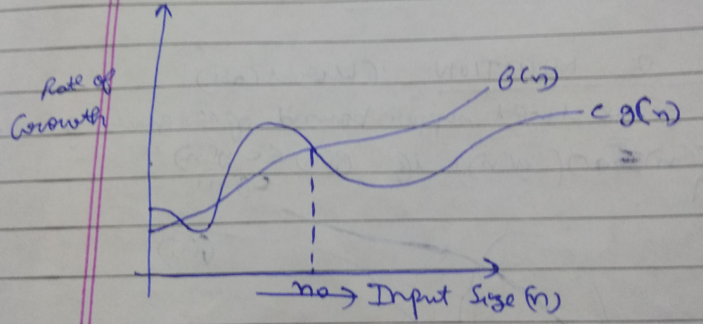
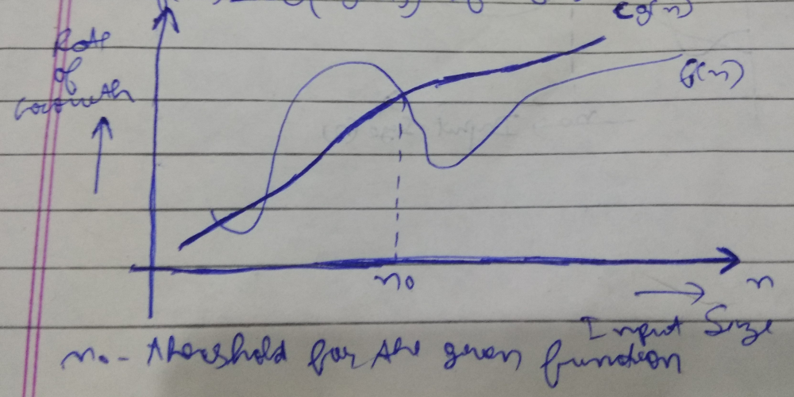
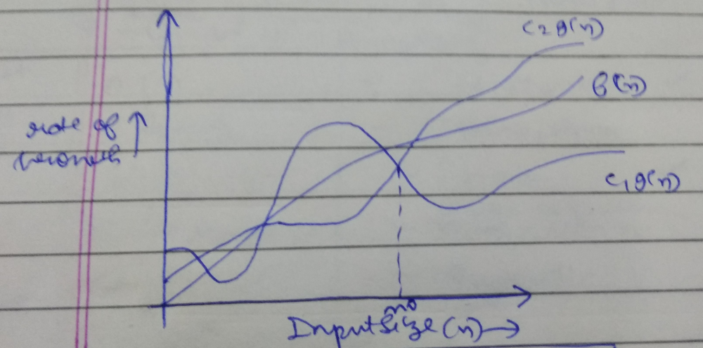

# [:arrow_left:](../README.md) DEFINATIONS

## :octocat: Algorithms

Algorithms are the series of steps which have no ambiguity that we follow to solve some problem. There are three types of Algorithms i.e

### :rocket: Iterative

If we are using loops to code our Algorithm than it is Iterative Algorithm.

### :rocket: Recursive

If we are using Recursion to code our Algorithm than it is Recursive Algorithm.

### :rocket: Constant

If we the ALgorithm is neither Iterative nor Recursive i.e it is taking constant time to run than it is called Constant ALgorithm.

## :octocat: Data Structures

Data Structures are the Structures formed by Data Types which makes our code efficient and we can use data in a systematic way. For example Stacks,Queues,Lists,arrays,etc.There are two types of Data Structures:

### :rocket: Linear Data Structures

Data Structures in which data is organised linear and in sequential order. For example

* Arrays,
* Lists,
* Queues,etc.

### :rocket: Non Linear Data Structures

Data Structures in which data is organised in non linear and in non-sequential order. For example

* Trees,
* Graphs,etc.

## :octocat: RATE OF GROWTH

The rate of growth is the growth at which our algorithm is increasing i.e **order of complexity increases and run time increases as our function input increases**.

 SNo. | Time Complexity | Type of complexity | Rate of growth | Increasing Order of Complexity
 ---- | --------------- | ------------------ | -------------- | ------------------------------
 1 | 1 | Constant | * | :arrow_down:
 2 | log log(n) | Double Logarithm | ** | :arrow_down:
 3 | log(n) | Logarithmic | *** | :arrow_down:
 4 | log(n)^c where c>1 | Polylogarithm | **** | :arrow_down:
 4.1 | log(n) ^ 2 | - | @ | :arrow_down:
 4.2 | log(n) ^ 3 | - | @@ | :arrow_down:
 5 | n^c where 0 < c < 1 | Fractional Power | ***** | :arrow_down:
 5.1 | n^0.1 | - | @ | :arrow_down:
 5.2 | n^0.5 or √n | - | @@ | :arrow_down:
 6 | n | Linear | ****** | :arrow_down:
 7 | nlog*(n) | n log - star n | ******* | :arrow_down:
 8 | nlog(n) or log(n!) | linearithmic, loglinear, or quasilinear | ******** | :arrow_down:  
 9 | n^c where c>1 | - | ********* | :arrow_down:
 9.1 | n^2 | Quadratic | @ | :arrow_down:
 9.2 | n^3 | Cubic | @@ | :arrow_down:
 10 | c ^ n | Exponential | ********** | :arrow_down:
 10.1 | 2 ^ log(n) | - | @ | :arrow_down:
 10.2 | 2^n | - | @@ | :arrow_down:
 10.3 | 4^n | - | @@@ | :arrow_down:
 11 | n! | Factorial | *********** | :arrow_down:
 12 | 2^(2^n) | | ************ | :arrow_down:

* @ - It is used for ordering as * is used for ordering
* (************) - Highest Rate of Growth
* (\*) - Smallest Rate of Growth
  * Source-Wikipedia and others

## :octocat: WORST CASE

The algorithm take max time for which input i.e it will complete and run slowly. The maximum time in which an Algorithm is solved.It is denoted using Big O Notation.

## :octocat: BEST CASE

The algorithm take less time for which input i.e it will complete and run faster. The minimum time in which an Algorithm is solved. It is denoted using Big Omega Notation.

## :octocat: AVERAGE CASE

The time calculated by average of best case and worst case and we can predict run time for an Algorithm.

## :octocat: ASYMPTOTIC NOTATIONS

There are total five types of Notations

### 1. Big O Notation (O)

* Big O Notation will gives the upper bound for an Algorithm.
* It is represented by **O()**.
* It will gives us the **Worst Case (Maximum time to solve the problem)** of the Algorithm.
* Big O Notation is a way of expressing the complexity related to number of items that an algorthm will deal with.
* Theoritically

```bash
f(n) = O(n)
If f(n) <= c * g(n)
```

* Example:

```math
f(n) = n^4 + n^3 + n^2 + n + 1
g(n) = n^4  (Maximum rate of growth of f(n))
```

* GRAPH



### 2. Big Omega Notation (Ω)

* Big Omega Notation will gives the lower bound of the Algorithm.
* It is represented by **Ω()**
* It will gives us the **Best Case (Minimum time to solve the problem)** of the Algorithm.
* Theoritically

```bash
f(n) = Ω(n)
If f(n) >= c * g(n)
```

* GRAPH



### 3. Theta Notation (θ)

* Big Theta Notation will gives the unique bound of the Algorithm i.e when upper bound and lower bound an Algorithm is same.
* It is represented by **θ()**
* It will gives the **Average Case (Single time to solve the problem)** of the Algorithm.
* Its relation is sometimes called as **Asymtotically Equal**.
* Theoritically

```bash
f(n)=θ(n)
If f(n) = c * g(n)
```

* GRAPH



### 4. Little O Notation (o)

```bash
f(n) < c * g(n)
```

### 5. Little Omega Notation (ω)

```bash
f(n) > c * g(n)
```

## :octocat: SORTING DEFINATIONS

### :rocket: Stable Sort

If the items order in array remain same before and after the sorting then it is called Stable Sort.

### :rocket: Unstable Sort

If the items order in array doesn't remain same before and after the sorting then it is called Unstable Sort.

### :rocket: InPlace ALgorithm

If the sorting technique doesn't require additional array for sorting then it is called InPlace Algorithm.

### :rocket: Out Place Algorithm

If the sorting technique requires additional array for sorting then it is called OutPlace Algorithm.
  
### :rocket: Internal Sorting

The sorting of data in main memory is called Internal Sorting.

### :rocket: External Sorting

Some Sorting techniques takes Secondary Memory for sorting data that sorting algoritms is known as External Sorting.

### :rocket: Adaptive Sorting

If the sorting technique doesn't sort the already sorted elements and doesn't change their order then that sort is called Adaptive Sort.

### :rocket: Non-Adaptive Sorting

If the sorting technique sort already sorted elements then it is called Non-Adaptive Sort.